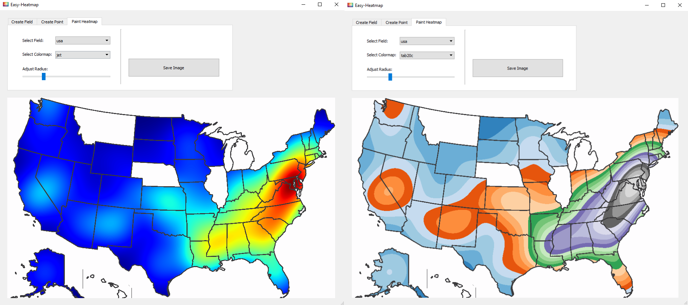

# Easy-Heatmap 

> **How you show the work is as important as how good you did the work!**

You can reveal spectacular results out of the data, run the most complex Machine Learning algorithms on the data, but it does not matter, if you don't present it beautifully. That is what **Easy-Heatmap** do with the power of **OpenCV** and **Qt5**. If you're working on a dataset with features that can be expressed on a 2D surface **Easy-Heatmap** enables you to create beautiful visualizations.

# Step by Step Create Your Heatmap
Follow the steps to render a ordinary image to a painting canvas. 
This example uses **Communities and Crime Data Set** and visualize states crime rates. For a detailed explanation regarding the data set, check the [data source](https://archive.ics.uci.edu/ml/datasets/Communities+and+Crime)

The image source for USA map: https://vividmaps.com/borders-united-states/
- **Step 1**: Upload raw image.
- **Step 2**: Select the fields you want to concatenate. You can save multiple fields and create seperate heatmaps on the same image!
**Note**: You can leave some fields empty if you have no data.
- **Step 3**: After saving the fields, upload your preprocessed data and place each point on the fields.

- **Step 4**: Select a matplotlib colormap and adjust the affect radius! You can check all the colormaps from [here](https://matplotlib.org/3.1.0/tutorials/colors/colormaps.html)

**Note**: Detailed tutorial will be added soon.
